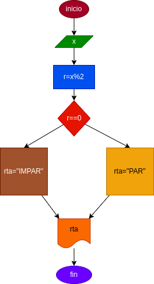

# PAR_IMPAR
programa para verificar si un numero x es par o impar 

# ANALISIS

Variabes de entrada (input)

x:numero cualquiera

Variables de proceso y salida (precessing, storage, output)

rta:nos va a decir si es par o impar 

# DISEÑO

# CONSTRUCCION
